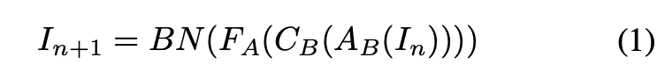
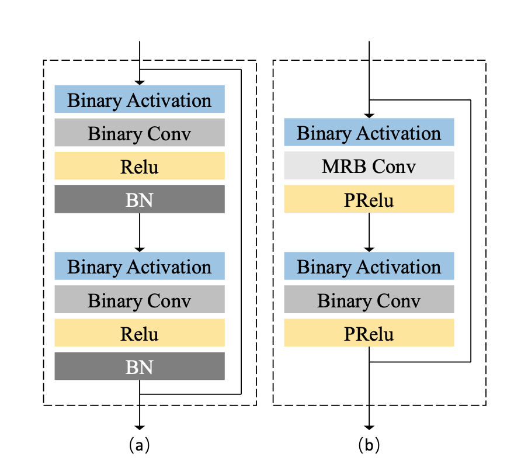
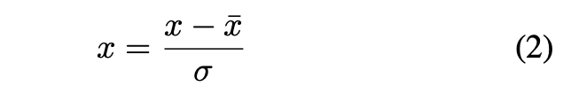

# Training Binary Neural Network without Batch Normalization for Image Super-Resolution

This readme file is an outcome of the [CENG501 (Spring 2022)](https://ceng.metu.edu.tr/~skalkan/DL/) project for reproducing a paper without an implementation. See [CENG501 (Spring 2022) Project List](https://github.com/CENG501-Projects/CENG501-Spring2022) for a complete list of all paper reproduction projects.

# 1. Introduction

@TODO: Introduce the paper (inc. where it is published) and describe your goal (reproducibility).

Network architectures used in Super Resolution field use batch normalization processes and computations with floating points. Batch normalization processes are the point of the network that require the most processing power and working with floating points makes networks difficult to work on low hardware capacity devices.

In order to overcome these problems Xinrui Jiang, Nannan Wang, Jingwei Xin, Keyu Li, Xi Yang, Xinbo Gao proposed  a method “Training Binary Neural Network without Batch Normalization for Image Super-Resolution” [1]. This study was published in The Thirty-Fifth AAAI Conference on Artificial Intelligence (AAAI-21) proceeding in 2021.

Our aim is to reproduce this study which does not have publicly available source code, to compare the results and to provide a code base for people who will reference this work later.

## 1.1. Paper summary

@TODO: Summarize the paper, the method & its contributions in relation with the existing literature.

Binary neural networks produce successful results in Super Resolution field. However, there are serious differences between binary networks and full precision networks in terms of performance. Especially batch normalization processes need powerful hardware as they contain floating point processes. In this paper, new methods that can run on low hardware are proposed. Proposed layers are replaced with the batch normalization step in the existing methods. In this way, it has shown that better results are obtained in terms of performance of state of art methods.

The super resolution is a method of obtaining a higher resolution version of the image from a low resolution image. The purpose of the paper is to train high-accuracy super resolution models without using the batch normalization method. The methods proposed in this paper are as follows. 

- Proposes effective binary training mechanism (BTM) which shows better performance without batch normalization layers. This helps to run network on low-precision devices.
- To show the performance of the proposed method, they find previous well suited optimization methods and compare them. Results show that proposed method surpasses existing binarization methods.
- A novel architecture which uses binary network and novel distillation strategy are proposed to improve existing super resolution methods.

# 2. The method and our interpretation

## 2.1. The original method

@TODO: Explain the original method.

### Binary Training Mechanism
In literature binary network in Figure 1a is usually used.  As shown in Equation 1, batch normalization is the last step of method. 


<center></center>

Batch normalizations are so important that they are recentering the input. So input can be limited to {-1 to +1}. But cons of the batch normalization is performance degradation. In this paper, new method which is binary training mechanism (BTM) is proposed to overcome above problem.


<center></center>
<center><b>Figure 1.</b> (a) original binary residual block (b) the proposed
multiple receptive-field binary residual block (MRB)</center>

- **Weight initialization**: simple initialization scheme Xavier uniform distribution is used because it is more stable

- **Data initialization**: SR networks inputs are normalized to be stable. In Equation 2, x denotes the input,  ̄x denotes the mean and σ denotes standard deviation for low resolution images set. After high resolution image is predicted by model, mean image is added to predicted image. This makes network more stable.

<center></center>


- **Activation**: PRelu which is suitable for binary networks is introduced.

## 2.2. Our Interpretation

@TODO: Explain the parts that were not clearly explained in the original paper and how you interpreted them.

Each input image is cropped with some scale factor but paper unspecified the number of crop size of single image. We adjust it to 5. So each input image produces 5 cropped images.

Epoch number for training is also unspecified. We tried several epoch numbers like 1000 and 10000. We tried to find max epoch number which achieve to minimum loss value.

Due to our personal computer resource limitations we trained our model with less train dataset. They are first 100 high and 100 low resolution images after sorted.

# 3. Experiments and results

## 3.1. Experimental setup

@TODO: Describe the setup of the original paper and whether you changed any settings.

We used DIV2K image set to train the model. Downloaded 100 high and 100 low resolution images out of 800 were used. Each input image is croped randomly for 5 times. As a result 500 images are used in training phase. After crop is completed, each image is normalized by subtracting the mean of set and divided by standard deviation of set.

## 3.2. Running the code

@TODO: Explain your code & directory structure and how other people can run it.

Our repo contains file as:
```
root
│─── images
│ 
│─── scripts/
│       │─── data/
│               │─── DIV2K_train_HR/
│               │─── DIV2K_train_LR_bicubic/ 
│                       │─── X2/
│                       │─── X3/
│                       │─── X4/
│       │─── blocks.py 
│       │─── dataset.py 
│       │─── div2k_downloader.sh 
│       │─── main.py 
│       │─── networks.py 
│       │─── utils.py 
│ 
│─── README.md
│ 
│─── requirements.txt
```

images directory contains documentation images. scripts/data folder will be created after dataset download script is run.
Our directory contains one bash script which name is "div2k_downloader.sh" to download DIV2K dataset and unzip it. Firstly it should be run. 
```
./scripts/div2k_downloader.sh
```
This will create data folder under scripts and will download and unzip DIV2K image dataset.

After download completed python based libraries should be installed.

```
pip3 install -r requirements.txt
```

To run model, main.py should be run lastly.

```
python scripts/main.py
```
## 3.3. Results

@TODO: Present your results and compare them to the original paper. Please number your figures & tables as if this is a paper.

# 4. Conclusion

@TODO: Discuss the paper in relation to the results in the paper and your results.

# 5. References

@TODO: Provide your references here.

[1] [Jiang, X., Wang, N., Xin, J., Li, K., Yang, X., & Gao, X. (2021). Training Binary Neural Network without Batch Normalization for Image Super-Resolution. Proceedings of the AAAI Conference on Artificial Intelligence, 35(2), 1700-1707](https://ojs.aaai.org/index.php/AAAI/article/view/16263)

# Contact

- **[Oğuz Gödelek](https://github.com/oguzgodelek) :** oguz.godelek [at] metu.edu.tr
- **[Gürcan Kavakçı](https://github.com/gurcankavakci) :** gurcan.kavakci [at] metu.edu.tr 


